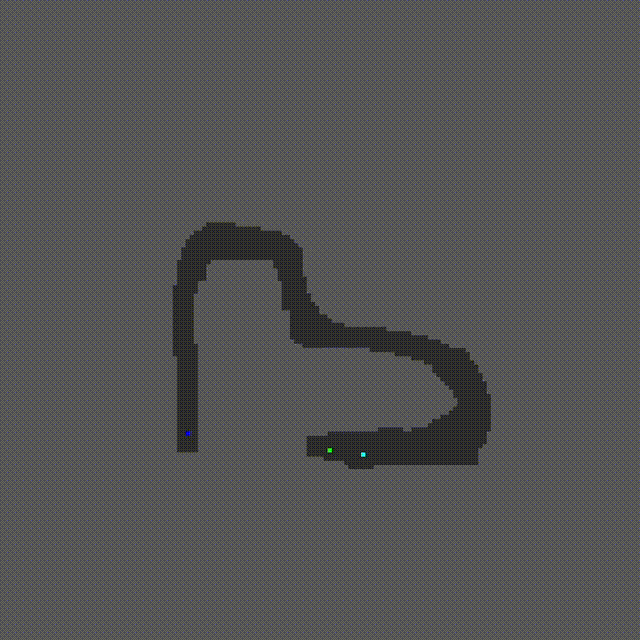

# RL Car Navigation from scratch

This project implements a Reinforcement Learning (RL) agent that learns to control and navigat a car. **Notably, all core Artificial Intelligence components, including the Deep Q-Network, neural network layers, and the Adam optimizer, are implemented entirely from scratch in C++, without reliance on external machine learning libraries.** 


## Project Overview

The primary goal of this project is to train an autonomous car to navigate a predefined track from a start ('S') position to a goal ('G') position on a 2D map. The agent learns through trial and error, interacting with the environment and receiving rewards or penalties based on its actions.

The agent perceives its environment using a `State` representation, which includes its position, direction, speed, and distances to walls and goal. It uses its Deep Q-Network (DQN) to approximate the optimal action-value function. Actions include accelerating, decelerating, and changing direction (Up, Down, Left, Right).

The project also includes a map editor for creating custom tracks and an SFML-based visualizer to display the agent's learned path.

## Project Structure

The project is organized into a `src` directory with several subdirectories:

* `src/`
    * `main.cpp`: Main entry point for the Map Editor and classic game (the game is intended for testing the enviroment).
    * `game_main.cpp`: Main entry point for training the RL agent.
    * `visualize.cpp`: Main entry point for the Movement Visualizer.
    * `AI/`
        * `Agent.h`RL logic, including action selection and learning from experience using the NN.
        * `NeuralNetwork.h` / `NeuralNetwork.cpp`: Implements the neural network*.
        * `Layer.h` / `Layer.cpp`: Defines individual neural network layers.
        * `Optimizer.h` / `Optimizer.cpp`: Implements the Adam optimizer.
        * `ReplayBuffer.h`: Provides the experience replay buffer.
        * `State.h`: Defines the agent's state representation.
    * `game/`
        * `Game.h` / `Game.cpp`: Manages the game simulation.
        * `Car.h` / `Car.cpp`: Defines the car's attributes and behavior.
        * `Map.h` / `Map.cpp`: Handles the game map.
    * `UI/`
        * `MapEditor.h` / `MapEditor.cpp`: Implements the SFML-based map editor.
        * `DisplayMovement.h` / `DisplayMovement.cpp`: Contains SFML logic to visualize movement.
* `Utils.h`: Contains common utilities like `Direction`, `MAP_WIDTH`, `MAP_HEIGHT`.
* `Makefile`: Used to compile the project.
* `assets/`
    * `track.txt`: Default file for saving/loading the game map.
    * `movements.txt`: Logs car movements.
    * `episode_rewards.txt`: Logs rewards per episode.
    * `episode_distance.txt`: Logs distance to goal per episode.
* `trained_agent/` 
    * Subdirectories for saved model weights and optimizer states.

## Training Process
  
The network is trained using the Adam optimizer.  
The architecture of the Deep Q-Network is as follows:

- 9 input features representing the current state  
- hidden layer with 128 neurons  
- hidden layer with 128 neurons  
- An output layer with 6 neurons

**Episodic Training:**
* **Episode Start:**
    * The car is reset.
    * Its starting position is the default 'S' on the map, or, periodically a random free cell is chosen to encourage broader exploration.
* **Step-by-Step Interaction:**
    * **State Perception:**
        * The current `State` of the car is constructed, including:
            * Its position.
            * Direction.
            * Speed.
            * Distances to walls in four cardinal directions.
            * Distance from goal using BFS.
    * **Action Selection:**
        * The `Agent` selects an `action` using its epsilon-greedy policy based on the `currentState`.
    * **Action Execution & Environment Update:**
        * The chosen action is translated into car controls.
    * **Reward Calculation:**
        * A `reward` is computed:
            * `+5 * improvement` for reducing `minDotsToGoal`.
            * Additional `+3 * improvement` if a new best distance is achieved.
            * `-1` penalty for each step taken (encourages efficiency).
            * `-5.0` penalty for visiting an already visited cell in the current episode (discourages loops).
            * `+500.0` for reaching the GOAL.
            * `-100.0` for a COLLISION.
    * **Experience Replay:**
        * The `agent.experience_replay` method is called to sample experiences and train the Q-network.
## Results

Due to hardware limitations, the training was performed on a relatively simple map that required fewer than 10,000 episodes to converge. Although this environment is less complex than real-world scenarios, it effectively demonstrated the functionality and learning capability of the agent.

The agent successfully learned to navigate from the start to the goal, steadily improving its performance throughout training. This is a satisfying outcome given that the entire Deep Q-Network and training pipeline are implemented in C++ from scratch, without GPU acceleration or external ML libraries all computations run on the CPU, this naturally limits training speed compared to GPU-accelerated frameworks.

Below is a short video showcasing the agent's learned navigation on the training map:




## Getting Started

### Compilation

A `Makefile` is provided to simplify the compilation process. Open your terminal in the root directory of the project (where the `Makefile` is located).

You can build specific components or all default targets:

* **Build the RL Trainer (default):**
    ```bash
    make rl_trainer 
    ```
    or simply:
    ```bash
    make
    ```
    This will create an executable named `rl_trainer`.

* **Build the Map Editor:**
    ```bash
    make editor
    ```
    This will create an executable named `editor`.

* **Build the Movement Visualizer:**
    ```bash
    make visualizer
    ```
    This will create an executable named `visualizer`.

* **Clean Build Files:**
    To remove all compiled object files (`.o`) and the executables:
    ```bash
    make clean
    ```

### Running

After successful compilation, you can run the executables from your terminal (from the project root):

#### Training the Agent

To start training the RL agent:
```bash
./rl_trainer
```

This runs the src/game_main.cpp program. Behavior (fresh train vs. load) is controlled by the load_agent boolean and load_path string within src/game_main.cpp.

Running the Map Editor

To create or edit game tracks:
```bash
./editor
```

This runs the src/main.cpp program, which should launch the MapEditor interface.

Running the Movement Visualizer

To view a replay of logged movements:

```bash
./visualizer
```

This runs the src/visualize.cpp program. 

